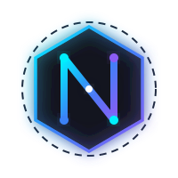

# Nexus Agent — Autonomous Desktop Operating Layer

<div align="center">



[](https://pages.cloudflare.com/)
[](https://react.dev/)
[](https://vitejs.dev/)
[](https://tailwindcss.com/)
[](https://ai.google.dev/)

**An autonomous, local-first desktop AI command layer engineered for high-performance workstation orchestration.**

[Explore Live Simulator](#interactive-features) • [Download Desktop Client](#downloads) • [Architecture](#architecture) • [Cloudflare Pages Deployment](#deployment-to-cloudflare-pages)

</div>

---

## 🌟 Overview

**Nexus Agent** is the next-generation operating system layer designed to bridge the gap between human intention and deterministic computer execution. Through bidirectional real-time audio streaming, spatial desktop telekinesis, automated ghost scripting, and zero-knowledge local vaults, Nexus Agent functions as a sovereign co-pilot on your physical hardware.

### Key Capabilities

- 🎙️ **Gemini Live Bidirectional Voice Streaming**: Ultra-low latency (<65ms) real-time audio interaction with instant interruption support and tool execution.
- 🪟 **Telekinesis Spatial Window Engine**: Multi-display window tiling, centering, and focus management with native Win32 PowerShell user32 fallbacks.
- ⚡ **Ghost Sequences (NutJS Robot)**: Deterministic execution of multi-step keyboard macros, mouse gestures, and shell commands without fragile coordinates.
- 🛡️ **Deep Work Focus Protocol**: Persistent 15-second background daemon monitoring that terminates blacklisted gaming and social media processes.
- 📊 **Doc & Office Forge**: Autonomous synthesis of complete slide presentations and structured spreadsheets saved directly to local storage.
- 🎨 **Wallpaper Engine & Cyber HUD**: Procedural 4K dynamic desktop wallpapers synced across Windows, macOS, and Linux.
- 🔒 **Dual-Tier Zero-Leak Privacy**: Local Bcrypt offline vaults with optional cloud sync via Supabase.

---

## 🚀 Quickstart

### 1. Clone & Run Locally

```bash
git clone https://github.com/NiranX-music/Nexus-Agent.git
cd Nexus-Agent

# Install dependencies
npm install

# Start local development server
npm run dev
```

Visit `http://localhost:3000` to interact with the full Nexus Agent Web Sandbox.

### 2. Build Production Bundle

```bash
npm run build
```

This compiles static production assets into `dist/` ready for Cloudflare Pages.

---

## 🌐 Deployment to Cloudflare Pages

This web application is pre-configured for **Cloudflare Pages** with `_routes.json`, `_headers`, and `wrangler.jsonc`.

### Option A: Via GitHub Integration (Recommended)
1. Go to the [Cloudflare Dashboard](https://dash.cloudflare.com/) > **Workers & Pages** > **Create application** > **Pages** > **Connect to Git**.
2. Select `NiranX-music/Nexus-Agent`.
3. Set the build configurations:
   - **Framework preset**: `Vite`
   - **Build command**: `npm run build`
   - **Build output directory**: `dist`
4. Click **Save and Deploy**. Any push to `main` will automatically build and deploy!

### Option B: Direct CLI Deployment via Wrangler
```bash
# Login to Cloudflare
npx wrangler login

# Deploy static assets
npx wrangler pages deploy dist --project-name nexus-agent
```

### Option C: Automated CI/CD
The repository includes [`deploy/cloudflare-pages.yml`](deploy/cloudflare-pages.yml). If you add workflow permissions to your token or configure GitHub Actions, simply place it into `.github/workflows/cloudflare-pages.yml` with `CLOUDFLARE_API_TOKEN` and `CLOUDFLARE_ACCOUNT_ID` in your GitHub Repository Secrets.

---

## 🏗️ Architecture

```
┌────────────────────────────────────────────────────────┐
│                   NEXUS AGENT WEB                      │
│      React 19 + Tailwind CSS 4 + Web Audio Worklet     │
└───────────────────────────┬────────────────────────────┘
                            │
┌───────────────────────────▼────────────────────────────┐
│              INTERACTIVE SUBSYSTEM SIMULATOR           │
│  ┌───────────────────────┐   ┌──────────────────────┐  │
│  │ Voice Bidi Stream (AI)│   │ Spatial Telekinesis  │  │
│  ├───────────────────────┤   ├──────────────────────┤  │
│  │ Ghost Macro Sequencer │   │ Focus Shield Daemon  │  │
│  ├───────────────────────┤   ├──────────────────────┤  │
│  │ Doc & Office Forge    │   │ Wallpaper Engine     │  │
│  └───────────────────────┘   └──────────────────────┘  │
└───────────────────────────┬────────────────────────────┘
                            │
┌───────────────────────────▼────────────────────────────┐
│                 DESKTOP HARDWARE ENGINE                │
│    Electron 41 • Node 24 • NutJS • Win32 User32 Hooks  │
└────────────────────────────────────────────────────────┘
```

---

## 💻 Downloads

Pre-built desktop packages for Nexus Desktop:

| Platform | Format | Architecture |
| :--- | :--- | :--- |
| **Windows 10 / 11** | `.exe` / Portable `.zip` | x64 |
| **macOS 12+** | `.dmg` | Apple Silicon (M1-M4) & Intel x64 |
| **Linux** | `.AppImage` / `.deb` | x64 / ARM64 |

---

## 📜 License & Credits

Created by **[NiranX](https://github.com/NiranX-music)** • Powered by **Antigravity & Nexdune**.  
Licensed under the [MIT License](LICENSE).
